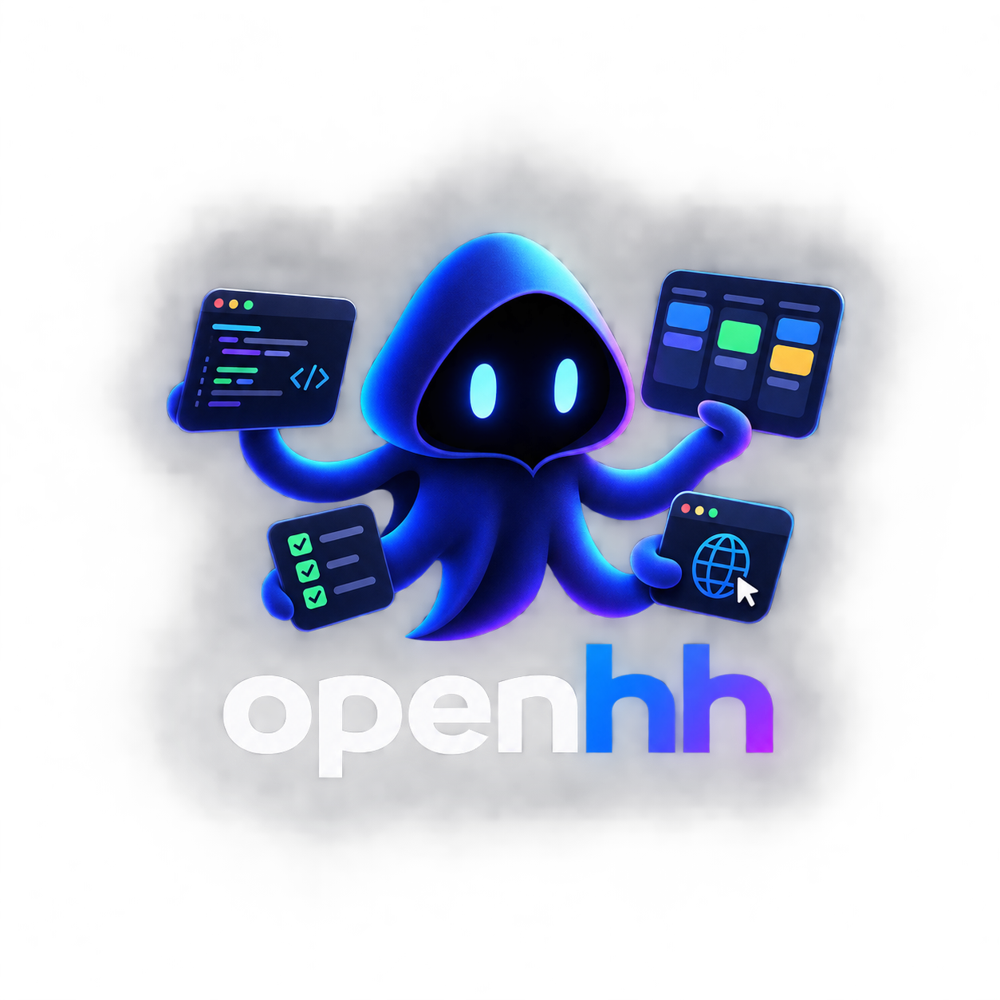

<p align="center">
  
</p>

A multi-agent coding pipeline on the [OpenHands SDK](https://github.com/OpenHands/software-agent-sdk)
with a web kanban dashboard. You give it a workspace directory and a spec;
a staged pipeline of agents builds it, handing the task to each other until
the final stage approves. Works with any OpenAI-compatible endpoint (e.g. a
locally hosted vLLM model).

The stages (pick any subset per task):

1. **Architect** — reads the spec and existing code, writes `ARCHITECTURE.md`
   with the chosen architecture and precise, testable requirements. Never
   writes code.
2. **Developer** — plans in `PLAN.md`, implements the spec, keeps `README.md`
   runnable, fixes issues reported by QA.
3. **QA** — runs the software like a real user: test suite, edge cases, and —
   for web UIs — real browser testing (it's the only agent with the browser
   tool). Hands bugs back to the developer, flawed requirements back to the
   architect, and declares the task done only when everything demonstrably
   works.

Each agent runs in its own disposable Docker container
(`ghcr.io/openhands/agent-server:latest-python`) that mounts only the task's
workspace directory, so nothing outside it is reachable.

## Prerequisites

- [uv](https://docs.astral.sh/uv/)
- a running Docker daemon (first run pulls a multi-GB agent image)
- an OpenAI-compatible LLM endpoint (vLLM, OpenRouter, …)

## Setup

```bash
uv sync
uv run ui.py        # http://localhost:7799
```

On first run a placeholder LLM profile is created — open **LLM profiles** in
the dashboard header and point it at your model/endpoint first (profiles are
stored in `llms.json`, which is gitignored because it holds API keys).

## Using the dashboard

**+ New task** takes a title, project, workspace directory, spec (file path
or pasted text), the stages to enable, and an LLM profile. The task's card
then follows the agent handoffs across the board columns (To Do → Architect →
In Dev → In QA → Done), moving backward on rework. Clicking a card shows each
agent's live log and plan. A finished task can be **reopened** with a
comment — a rerun that receives your notes as rework instructions.

Every task belongs to a **project** — a workspace with a codename, a color,
and a task queue. Select one to queue the task after that project's earlier
tasks (the workspace is inherited from the project); leave it empty to start
a fresh project with a random codename. Tasks in the same project run
sequentially, different projects run in parallel up to `--max-parallel`
(default 2). If a task fails, its project's queue holds: the next card shows
what blocked it with a **run anyway** override, and reopening the failed task
puts the repair at the front of the queue — the chain resumes when it passes.

The server binds to localhost by default; the UI has no auth and tasks
execute code, so don't expose it beyond your machine.

## Tuning

- **Agent behavior** — edit the `ARCH_ROLE` / `DEV_ROLE` / `QA_ROLE` prompt
  strings in `pipeline.py`; the handoff rules live in `handoff_protocol()`.
- **Models** — add profiles in the LLM profiles modal and pick one per task;
  for different models per role, pass a distinct `LLMConfig` per agent in
  `pipeline.py:build_agent`.
- **Existing codebases** — point the workspace at a repo and add
  repo-specific rules (build/test commands, don't-touch areas) to the spec.
- **Custom agent image** — to avoid reinstalling toolchains every run, bake
  your stack on top of the agent-server image and pass it via `server_image`
  in `pipeline.py:make_workspace`.

## License

[MIT](LICENSE)
